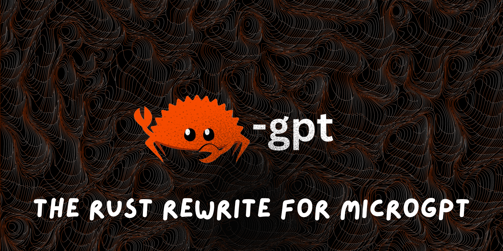
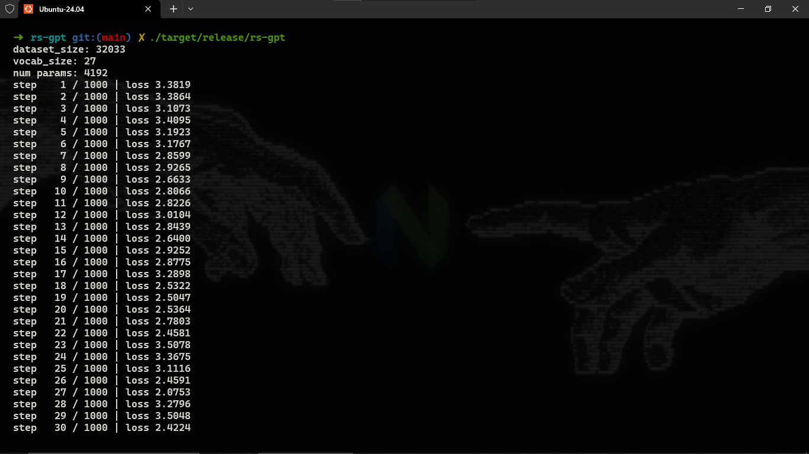
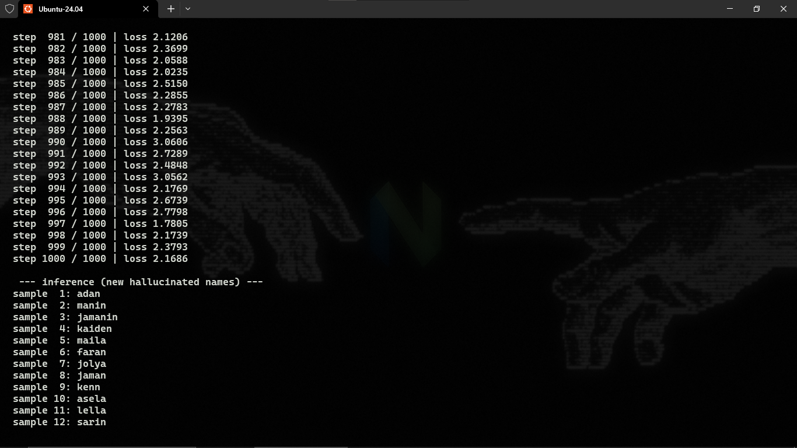
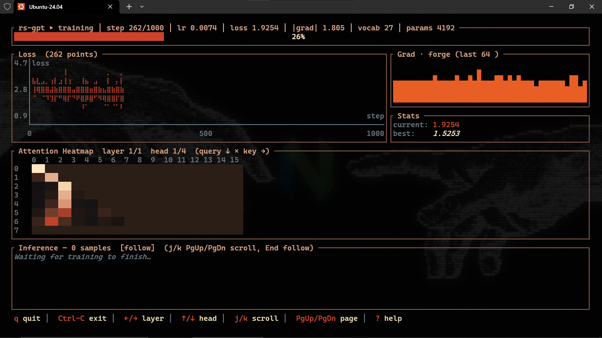
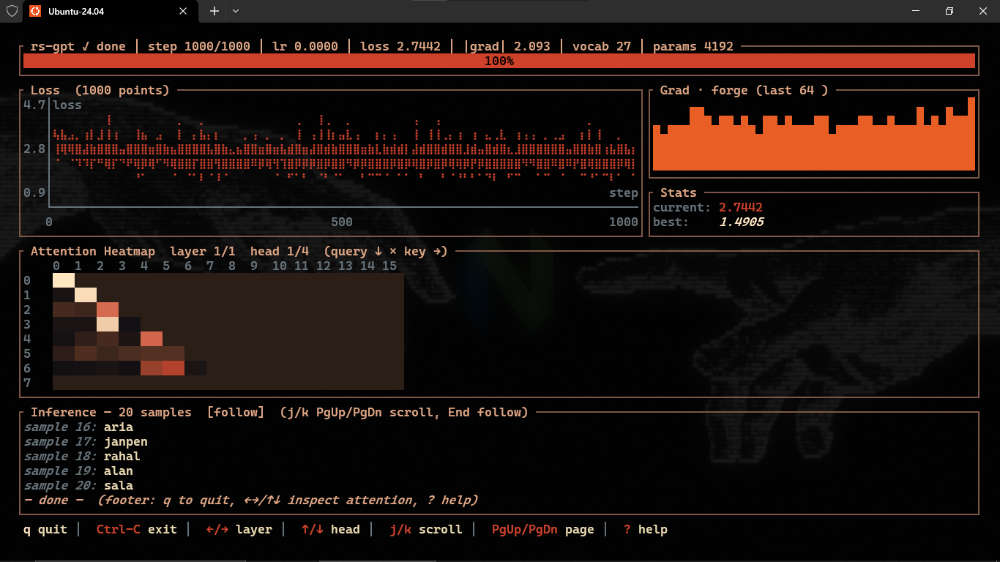

# rs-gpt

<p align="center">
    
</p>


A Rust implementation of Andrej Karpathy's [microgpt](https://gist.github.com/karpathy/8627fe009c40f57531cb18360106ce95).

## Demo


## Installation

Prerequisites: Rust 1.85 or later.

```bash
# from crates.io
cargo install rs-gpt

# from source
git clone https://github.com/theawakener0/rs-gpt
cd rs-gpt
cargo install --path .
```

> [!NOTE]
> Prebuilt binaries for Linux, macOS, and Windows are attached to every [GitHub release](https://github.com/theawakener0/rs-gpt/releases).
> If you had trouble in windows, please try to use it in WSL or VM.

## Usage

```bash
# classic CLI 
rs-gpt

# ratatui TUI
rs-gpt --tui
```

Classic mode trains for 1000 steps on a [dataset](dataset/input.txt) (Adam: lr 0.01 linearly decayed, β1 0.85, β2 0.99) and samples 20 names at temperature 0.5.

Classic mode screenshots:

<p align="center">
    
    
</p>

TUI mode trains with the same hyperparameters (1 layer, 16 embd, 4 heads, block_size 16) for 1000 steps on a [dataset](dataset/input.txt) and samples 20 names at temperature 0.5.

TUI mode screenshots:

<p align="center">
    
    
</p>

> [!NOTE]
> The classic mode is the real microgpt rewrite that I wrote by myself, while the TUI mode is a restructure of the classic mode and AI wrote it.

## Acknowledgement

This project is heavily inspired by [microgpt](https://gist.github.com/karpathy/8627fe009c40f57531cb18360106ce95) and [microgpt-rs](https://github.com/stochastical/microgpt-rs).

## License

MIT — see [LICENSE](LICENSE).
